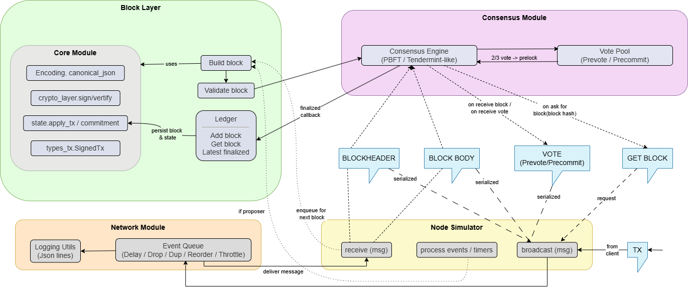

## Thành viên thực hiện

| STT | MSSV | Họ và Tên |
| :-: | :--: | :--- |
| 1 | 21120268 | Nguyễn Việt Khánh |
| 2 | 21120224 | Lều Huy Đức |
| 3 | 22120382 | Nguyễn Anh Trí |
| 4 | 22120242 | Nguyễn Minh Nhã  |
| 5 | 21120005 | [Tên thành viên] |
# Blockchain Lab 01 - HCMUS

Dự án này là một mô phỏng blockchain được phát triển cho môn học Blockchain và ứng dụng tại Trường Đại học Khoa học Tự nhiên, ĐHQG-HCM (HCMUS). Nó cung cấp một framework để mô phỏng mạng lưới blockchain, bao gồm tương tác giữa các node, cơ chế đồng thuận và lan truyền khối.

Hệ thống được thiết kế với các thành phần modul hóa nhằm đảm bảo dễ mở rộng, dễ phân tích và kiểm thử. Việc phân tách rõ ràng giữa các thành phần giúp hệ thống dễ dàng mô tả, theo dõi và phân tích từng bước của quá trình đồng thuận:

- **Simulator**: Đóng vai trò điều phối, quản lý vòng lặp sự kiện rời rạc và tiến trình của toàn bộ hệ thống.
- **Node**: Mô phỏng một validator với ledger cục bộ, mempool và trạng thái ứng dụng.
- **ConsensusEngine**: Đóng gói toàn bộ logic đồng thuận theo kiến trúc tách biệt.
- **Network**: Mô phỏng môi trường P2P với độ trễ, mất gói, và băng thông giới hạn.

## Tính năng

- **Mô phỏng Blockchain**: Mô phỏng một mạng lưới các node duy trì một sổ cái phân tán.
- **Cơ chế Đồng thuận**: Cài đặt logic đồng thuận để đảm bảo sự thống nhất về trạng thái của blockchain.
- **Tính Tất định (Determinism)**: Hỗ trợ mô phỏng tất định, trong đó cùng một seed sẽ tạo ra kết quả giống hệt nhau, rất quan trọng cho việc gỡ lỗi và kiểm tra.
- **Có thể Cấu hình**: Hoàn toàn có thể cấu hình thông qua các file YAML để điều chỉnh tham số mạng, hành vi của node và cài đặt mô phỏng.
- **Kiểm thử Toàn diện**: Bao gồm các unit test, integration test và end-to-end (E2E) test.

## Cấu trúc Dự án

```
blockchain-lab01-hcmus/
├── config/                 # Các file cấu hình (YAML)
├── logs/                   # Log mô phỏng và báo cáo
├── src/                    # Mã nguồn
│   ├── blocklayer/         # Logic quản lý khối
│   ├── consensus/          # Cài đặt thuật toán đồng thuận
│   ├── core/               # Cấu trúc dữ liệu cốt lõi (Block, Transaction, v.v.)
│   ├── network/            # Mô phỏng mạng (độ trễ, truyền tin)
│   ├── node_sim/           # Mô phỏng node và hành vi
│   ├── main.py             # Điểm nhập chính (Main entry point)
│   └── determinism_test.py # Script kiểm tra tính tất định của mô phỏng
├── tests/                  # Bộ kiểm thử (pytest)
├── requirements.txt        # Các thư viện Python phụ thuộc
└── README.md               # Tài liệu dự án
```


## Cài đặt

1.  Clone repository:
    ```bash
    git clone <repository_url>
    cd blockchain-lab01-hcmus
    ```

2.  Cài đặt các thư viện phụ thuộc:
    ```bash
    pip install -r requirements.txt
    ```

## Hướng dẫn Sử dụng

Dự án sử dụng `src/main.py` làm điểm nhập trung tâm cho các chế độ hoạt động khác nhau.

### 1. Chạy Mô phỏng (Simulator)

Để chạy mô phỏng blockchain với cấu hình mặc định:

```bash
python src/main.py --mode simulator
```

**Tùy chọn:**
- `--config`: Đường dẫn đến file cấu hình tùy chỉnh (mặc định: `config/default_config.yaml`).
- `--seed`: Seed ngẫu nhiên để tái lập kết quả (mặc định: `0`).
- `--steps`: Số bước mô phỏng tối đa.
- `--output`: Đường dẫn để lưu log đầu ra của mô phỏng.

**Ví dụ:**
```bash
python src/main.py --mode simulator --config config/my_config.yaml --seed 123 --steps 1000
```

### 2. Chạy Kiểm thử (Tests)

Dự án sử dụng `pytest` để kiểm thử. Bạn có thể chạy toàn bộ hoặc từng phần kiểm thử.

**Chạy toàn bộ kiểm thử:**
```bash
python src/main.py --mode test
```
Hoặc:
```bash
pytest tests/ -v
```

**Chạy từng file kiểm thử cụ thể:**

- **Unit Tests (Kiểm thử đơn vị):**
  Kiểm tra các thành phần cơ bản như Block, Transaction, và các hàm tiện ích.
  ```bash
  pytest tests/test_unit.py -v
  ```

- **Core Tests:**
  Kiểm tra các cấu trúc dữ liệu cốt lõi.
  ```bash
  pytest tests/test_core.py -v
  ```

- **Block Layer Tests:**
  Kiểm tra logic quản lý blockchain, xác thực block và transaction.
  ```bash
  pytest tests/test_blocklayer.py -v
  ```

- **Consensus Tests:**
  Kiểm tra thuật toán đồng thuận (ví dụ: PoW, PoS hoặc cơ chế tùy chỉnh của lab).
  ```bash
  pytest tests/test_consensus.py -v
  ```

- **Network Tests:**
  Kiểm tra mô phỏng mạng, truyền tin giữa các node.
  ```bash
  pytest tests/test_network.py -v
  ```

- **End-to-End (E2E) Tests:**
  Kiểm thử toàn bộ hệ thống từ đầu đến cuối, mô phỏng kịch bản thực tế.
  ```bash
  pytest tests/test_e2e.py -v
  ```

**Chạy một test case cụ thể:**
Sử dụng cờ `-k` để lọc tên test.
```bash
pytest -k "test_block_validation" -v
```

### 3. Kiểm tra Tính Tất định (Determinism)

Để xác minh rằng mô phỏng là tất định (tức là chạy hai lần với cùng một seed sẽ tạo ra log giống hệt nhau):

```bash
python src/main.py --mode determinism --seed 42
```

Lệnh này sẽ:
1. Chạy mô phỏng hai lần với seed đã chỉ định.
2. So sánh các log đầu ra theo từng byte.
3. Tạo báo cáo tại `logs/run_compare.txt`.

## Cấu hình

Mô phỏng được cấu hình bằng các file YAML nằm trong thư mục `config/`. Bạn có thể sửa đổi `config/default_config.yaml` hoặc tạo file riêng để thay đổi các tham số như:
- Số lượng node
- Độ trễ mạng (latency)
- Thời gian tạo khối
- Các tham số đồng thuận

## Kết quả và Kết luận

### 1. Kiểm thử đơn vị (Unit Tests)

| Test Case | Thành phần | Mô tả | Kết quả |
| :--- | :--- | :--- | :--- |
| `test_crypto_signatures` | Core | Kiểm tra tạo/xác thực chữ ký, kiểm tra context và phát hiện dữ liệu bị can thiệp. | PASSED |
| `test_state_update` | Core | Kiểm tra cập nhật state đúng với các giao dịch. | PASSED |
| `test_vote_verification` | Consensus | Kiểm tra chữ ký và cấu trúc vote. | PASSED |
| `test_block_validation` | Blocklayer | Kiểm tra tính toàn vẹn block, liên kết parent và chữ ký validator. | PASSED |
| `test_basic_flow` | Consensus | Mô phỏng vòng đồng thuận cơ bản (Propose → Prevote → Precommit → Finalize). | PASSED |
| `test_locking_safety` | Consensus | **Quan trọng**: đảm bảo node đã khóa block không vote block xung đột. | PASSED |
| `test_vote_buffering` | Consensus | Kiểm tra buffering vote đến sớm hoặc vote của round tương lai. | PASSED |
| `test_fast_forward` | Consensus | Kiểm tra khả năng “bắt kịp” khi thấy block height cao hơn đã được finalize. | PASSED |

### 2. Kiểm thử đầu cuối (End-to-End Tests)

| Test Case | Mô tả | Kỳ vọng | Kết quả |
| :--- | :--- | :--- | :--- |
| `test_simulation_run` | Kiểm tra vòng lặp của Simulator. | Mô phỏng chạy N bước không lỗi. | PASSED |
| `test_determinism` | Chạy mô phỏng hai lần với cùng seed. | Kết quả đầu ra phải giống nhau. | PASSED |
| `test_transaction_propagation` | Bơm giao dịch và kiểm tra truyền tới các node khác. | TX xuất hiện trong mempool/block của node khác. | PASSED |
| `test_block_proposal` | Kiểm tra tạo và finalize block. | Chiều cao chuỗi tăng lên. | PASSED |
| `test_safety_one_block_per_height` | Kiểm tra sự nhất quán. | Tất cả node có cùng hash tại mỗi height. | PASSED |
| `test_security_invalid_messages` | Gửi thông điệp sai chữ ký/sai context. | Hệ thống từ chối, đồng thuận không bị ảnh hưởng. | PASSED |
| `test_robustness_replays_duplicates` | Mô phỏng mạng có tỉ lệ duplicate cao. | Hệ thống bỏ qua bản sao; safety/liveness duy trì. | PASSED |
| `test_network_issues_drops_delays` | Mô phỏng mất gói và độ trễ lớn. | Đồng thuận vẫn finalize block; chain nhất quán. | PASSED |

### 3. Kết luận

Kết quả kiểm thử cho thấy hệ thống blockchain mô phỏng đáp ứng đầy đủ các yêu cầu về:

- **Safety** – không tồn tại hai block khác nhau tại cùng một height.
- **Liveness** – hệ thống luôn tiến triển, block được finalize.
- **Security** – chỉ các thông điệp hợp lệ mới được xử lý.
- **Determinism** – cùng một seed sẽ luôn cho kết quả giống nhau.

Hệ thống hoạt động ổn định và chính xác trong tất cả các kịch bản kiểm thử.


## Đóng góp

- **Môn học**: Blockchain và ứng dụng - HCMUS
- **Lab**: 01


